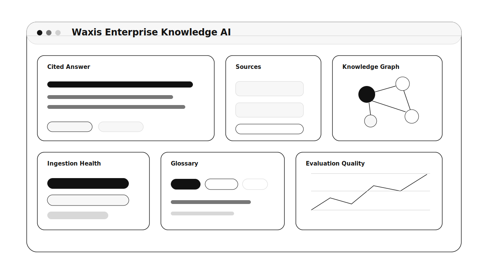

# Waxis Enterprise Knowledge & Domain AI

Permissioned enterprise knowledge software for document ingestion, hybrid retrieval, RAG, citations, GraphRAG-style domain reasoning, glossary control, and agent-ready knowledge APIs.

## What It Is

Waxis Enterprise Knowledge & Domain AI turns internal documents, SOPs, policies, contracts, product docs, support history, and expert knowledge into a trusted AI knowledge system.

It is built for companies where answers must be source-backed, permission-aware, current, and aligned with company terminology. The product gives employees and business agents a reliable way to search, answer, cite, compare, and improve enterprise knowledge.

## What Users See

The product experience is simple: ask a question, get a sourced answer, inspect the evidence, and improve the knowledge base when something is missing.

Users can see:

- Permissioned search and answer results
- Source cards with document version, owner, freshness, and citations
- Ingestion health across document sources
- Knowledge graph relationships for complex domains
- Glossary terms, synonyms, and preferred language
- Evaluation results for retrieval and answer quality
- Knowledge gaps and stale document queues

## Core Product Screens

- Employee Search: cited answer, source preview, confidence, freshness, and feedback
- Source Manager: connectors, ingestion status, parsing errors, sync health, and metadata
- Permission Center: source access groups, document status, restricted content, and audit
- Knowledge Graph: entities, relationships, topic clusters, and domain summaries
- Glossary Studio: acronyms, synonyms, deprecated terms, and preferred domain language
- Evaluation Lab: golden questions, expected sources, citation quality, faithfulness, and regressions
- Knowledge Gap Queue: unanswered questions, stale sources, conflicts, and SME review

## A Typical Workflow

1. Admin connects or uploads approved knowledge sources.
2. The system parses, chunks, indexes, and tags documents with metadata and access controls.
3. A user asks a question in natural language.
4. Retrieval applies permissions first, then finds the best source passages.
5. AI generates a cited answer or says when the sources are not enough.
6. Feedback and failed questions become knowledge gaps or evaluation cases.

## Who It Is For

- Knowledge owners managing SOPs, policies, product docs, and training material
- Employees who need trusted internal answers
- Support and sales teams that need consistent customer-facing knowledge
- Compliance teams that need permission, audit, and source control
- Developers building agents that need reliable enterprise context

## MVP Shape

The first version should feel like a trusted internal search and answer system: every answer has sources, every source has an owner, permissions are enforced before retrieval, and unknowns become knowledge work instead of hallucinations.

## Product Requirements

The complete product requirements document is here:

- [PRD.md](./PRD.md)

## Research Basis

This repo uses a June 2026 research snapshot across official RAG, grounding, enterprise search, graph retrieval, agent connector, and AI safety sources, including OpenAI File Search, Amazon Bedrock Knowledge Bases, Google Agent Search, Microsoft GraphRAG, MCP, NIST AI RMF, and OWASP LLM Top 10.

